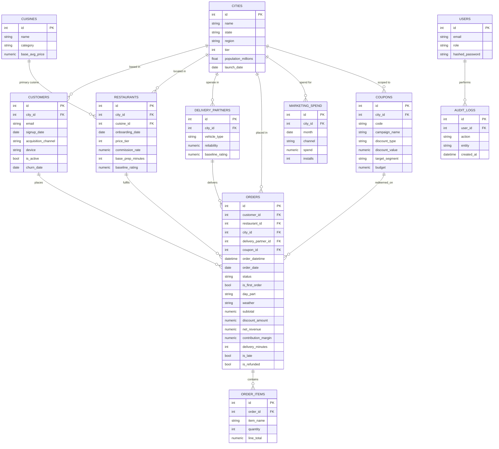

# Database Schema & ER Diagram

The schema follows a **star-ish** shape: `orders` is the central fact table
(analytical grain = one order) surrounded by dimension tables. Several derived
values (unit economics, time context, SLA flags) are **pre-computed onto
`orders`** at load time — mirroring how a real warehouse curates a `fct_orders`
model instead of recomputing on every query.

## ER diagram

## Tables

| Table | Grain | Purpose |
|-------|-------|---------|
| `cities` | one city | Geography dimension (tier, region, launch date) |
| `cuisines` | one cuisine | Catalog dimension |
| `customers` | one customer | Who orders — signup, channel, lifecycle |
| `restaurants` | one restaurant | Supply — cuisine, price tier, commission, prep time |
| `delivery_partners` | one rider | Last-mile supply, reliability |
| `coupons` | one campaign/code | Promotions with budget, targeting, scope |
| `marketing_spend` | city × month × channel | Paid acquisition spend for CAC/ROAS |
| `orders` | **one order (fact)** | The analytical core with pre-computed economics & SLA |
| `order_items` | one line item | Basket detail for drill-down |
| `users` | one operator | Platform login (Admin/PM/Analyst) |
| `audit_logs` | one action | Append-only privileged-action log |

## Key `orders` columns (pre-computed at load)

- **Economics:** `commission_amount`, `delivery_cost`, `payment_gateway_cost`,
  `support_cost`, `gross_revenue`, `net_revenue`, `contribution_margin`
- **Time context:** `order_date`, `day_part`, `is_weekend`, `is_festival`, `weather`
- **SLA:** `promised_minutes`, `prep_minutes`, `delivery_minutes`, `is_late`, `distance_km`
- **Lifecycle:** `is_first_order`
- **Experience:** `restaurant_rating`, `delivery_rating`, `is_refunded`, `refund_amount`

## Indexing

Composite indexes mirror the analytics engine's common `GROUP BY`s:
`(order_date, status)`, `(customer_id, order_date)`, `(city_id, order_date)`, plus
single-column indexes on every FK and the categorical filter columns.
